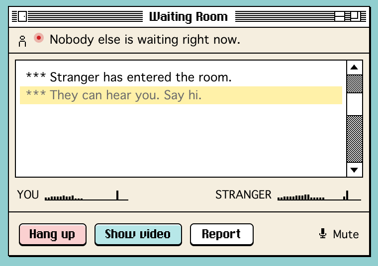

# waiting-room

[](LICENSE)

Why wait alone when you can wait with others? Introducing the Claude Waiting Room, an Omegle-like voice & video chat room that matches you with someone else who is also waiting for their Claude. Stop crossing your arms with a grumpy face, staring at your computer screen alone. You can do that together with a stranger, and potentially meet new friends or even new love?!

A Claude Code plugin. The plugin never tells them anything about your task.

## How it works

1. Your Claude works for more than 15 seconds. A small window opens behind your terminal with one line: how many others are waiting.
2. Someone else is waiting too. A notification knocks, the door sound plays, and the window unrolls: Stranger has entered the room. Audio first; video only when you both click Show video.
3. Either Claude finishes. A ten-second countdown, and the window closes itself.

## Look



Classic Mac window dressing in the Poolsuite spirit: cream panel, one-pixel black, pastel desktop tints, pixel type for the title and labels, Geneva for the lines, a bar-graph meter, and a dot screen over video. Nothing here is an Apple or Poolsuite asset. Omegle is the joke and the reference, never the copy. The mockup: https://claude.ai/code/artifact/447cf200-0465-4dcf-8ff0-984537a43877

## Install

You need a Mac with Google Chrome and Claude Code. The lobby is open: no invite code. Chrome is what the window is built for; without it the default browser opens it, with fewer guarantees.

```
claude plugin marketplace add Dav1dyang/waiting-room
claude plugin install waiting-room@waiting-room
```

Start a new `claude` session anywhere:

```
/waiting-room:on                      # prints the rules, opens the setup page once
```

The setup page opens in the plugin's own Chrome window. Allow the microphone on every visit and allow notifications. Play the door, pick a tint, then set up a test window and send Claude any message. The test window shows you the goodbye once. From then on, give Claude something that takes a while.

```
/waiting-room:status                  # on or off, and how many others are waiting
/waiting-room:off                     # stops everything and closes any window
```

To run this checkout instead of an installed copy, see `plugin/README.md`.

## The rules

Audio first. Video only when you both click Show video. Your task stays on your machine. waiting-room records nothing. Rooms end after 30 minutes. Be kind; Report is one click. Three reports in a day and you are out for a day.

## What leaves your machine

Each hook sends one small POST with exactly five fields: `token`, `event` (one of `started`, `tick`, `needs_you`, `paused`, `stopped`), `why`, `session` (a hash of the session id), and `ts`. Nothing else. The classifier runs on your machine (`plugin/scripts/classify.js`), and the tests check that no prompt, path, or tool input ever reaches the body. The call itself goes browser to browser, so the two browsers exchange network addresses the way every WebRTC call does; the lobby only passes the messages that set it up.

## What is where

| Path | What it is |
| --- | --- |
| `plugin/` | The Claude Code plugin: eight async hooks, three commands, the classifier, the window opener. `plugin/README.md` for install and uninstall. |
| `worker/` | The lobby: one Cloudflare Worker, one Durable Object, the pure state machine in `src/lobby-core.js`, the room and setup pages in `public/`. `worker/README.md` for deploy. |
| `scripts/probe-mac.sh` | Opens one real room window through the real path and reads back what it measured. |
| `docs/PROTOCOL.md` | The contract between plugin, lobby, and window: routes, messages, numbers, states. |
| `docs/PHASE0.md` | What was measured on a Mac, and the ten-minute checklist that is left. |
| `docs/index.html` | The plan, v0.6. Older plans in `docs/archive/`. |
| `docs/DECISIONS.md`, `docs/CHANGELOG.md`, `docs/QUESTIONS.md` | Decision log D-01 to D-100, change log, the questions and their answers. |
| `docs/research/` | Ten research memos: lineage, plugin mechanics, hosting and WebRTC, product history and safety, Omegle UI, ecosystem and naming, retro chat windows, auto-open windows, Poolsuite colour, video dither and window shade. |
| `design/` | Mockup v2.5: the generator, ten artboards, the canvas, the font. |

## Made with

Planned and built 2026-09-05 to 2026-09-07 with Claude Code (Fable 5.1): ten Opus 5 research agents, three Opus 5 builders, and review passes by Codex and Claude after every phase. The plan: https://claude.ai/code/artifact/7f5e1d8a-4c07-46ab-9506-507936b4ff27.

## Tests

```
cd worker && npm install
npm test                              # core, pages, one whole wait through wrangler dev
npm run e2e                           # two Chrome windows meet through the mock lobby
WR_E2E_BASE=https://<lobby> npm run e2e   # the same, against a live lobby (add WR_E2E_INVITE=<code> if yours needs one)
bash ../plugin/test/run.sh            # the plugin against a fake lobby
claude plugin validate --strict ../plugin
bash ../scripts/probe-mac.sh          # one real window on this Mac (needs Google Chrome)
```

To collect the Phase 0 timing data, set `WAITING_ROOM_LOG=~/.waiting-room/log.txt` in your shell for a week. Each hook appends one line: the five fields and the lobby's answer (open, quit, or nothing).

## License

MIT. The ChiKareGo2 font is by Giles Booth under CC BY 4.0 and keeps its own terms; see `LICENSE`.
